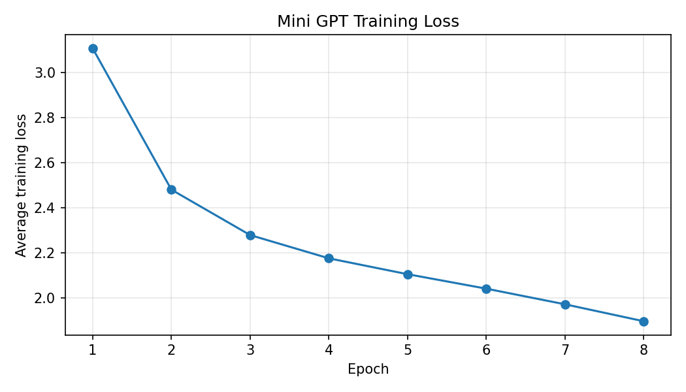

# Homework 4: Building a Mini GPT from Scratch

**SID4:** 1598 | **SEED:** 1598 | **SLICE:** 598  
**HP_ID:** 2 | **CLS_A:** 8 | **CLS_B:** 5

## Model and training

I extended the TA demo to a character-level GPT with four attention heads and two decoder blocks. The model uses manual causal masking, learnable token and positional embeddings, pre-LayerNorm as in the demo, residual connections, and a Linear → GELU → Linear feedforward network. The final projection predicts a score for each character.

| Setting | Value |
|---|---|
| Dataset | Provided shakespeare.txt |
| Characters / vocabulary | 1,738 / 49 |
| Sequence length / training pairs | 128 / 1,610 |
| Hidden dimension / heads / blocks | 128 / 4 / 2 |
| Trainable parameters | 425,777 |
| Optimizer / learning rate | Adam / 0.0003 |
| Batch size / epochs | 32 / 8 |

The training loss decreased from 3.1064 to 1.8965 over eight epochs. This shows better prediction of the training characters, but it does not measure performance on unseen text.

The run used CPU, Python 3.13.9, and PyTorch 2.14.0. The saved notebook shows successful output-shape and causal-mask checks. Only SEED affects this assignment; the remaining personal parameters are reported as required.

## Decoding comparison

All methods use the same trained model, prompt `ROMEO:`, and 300 new characters. The seed is reset to 1598 for each sample. Top-k uses temperature 1.0.

- **Greedy:** chooses the highest-probability next character.
- **Temperature:** rescales logits before sampling; lower values concentrate the choices, while higher values spread them out.
- **Top-k:** samples only from the k highest-scoring characters.

| Setting | Observation from my output |
|---|---|
| Greedy | Repeated “the the the” and “al al al”; little progress in meaning. |
| Temperature 0.5 | Started with “What name”; later repeated letters and produced broken words. |
| Temperature 1.0 | More varied fragments, but unclear words and sentences. |
| Temperature 1.5 | Unusual spellings, mixed capitalization, and punctuation; the most varied-looking sample. |
| Top-k 2 | Recognizable fragments such as “that thou name”, with frequent repetition. |
| Top-k 20 | More varied than k = 2, but many malformed words. |

**Most coherent:** Top-k with k = 2 was slightly more readable to me because it produced recognizable short fragments. None of the methods produced a fully coherent passage, so this is a relative judgment based on the displayed samples.

**Most diverse:** Temperature 1.5 appeared the most diverse because it produced more unusual character combinations, capitalization, and punctuation. The extra variety also made the output harder to understand. This is a qualitative comparison, not a measured diversity score.

The dataset contains only 1,738 characters, and neighboring training windows overlap heavily. A small model trained on this text can learn local patterns without producing fluent language. Lower training loss does not guarantee meaningful sentences. These findings describe one fixed-seed sample per setting.

The complete generated samples and loss values are preserved in the executed notebook and results.json.
